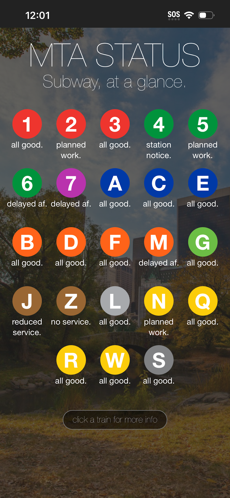

# MTA Status

NYC subway status, at a glance.

A JavaScript rewrite of [mta_status](https://github.com/johnrbell/mta_status) (Ruby/Sinatra).

<p align="center">
  
</p>

## Features

- Real-time subway status for all 23 NYC lines via the [MTA GTFS-RT alerts feed](https://api-endpoint.mta.info/Dataservice/mtagtfsfeeds/camsys%2Fsubway-alerts.json)
- Severity-based alert ranking — shows the worst active alert per line
- Click any train with an active alert for detailed info in a modal
- Rotating NYC background images (cached to disk, refreshed every 5 minutes)
- Train data cached in memory for 5 minutes
- PWA-ready — installable on iOS and Android home screens
- Responsive design with official MTA line colors
- 404 page for invalid train routes

## Setup

```bash
npm install
npm run dev
```

Runs on [http://localhost:5173](http://localhost:5173).

For production:

```bash
npm run build
npm start
```

Runs on [http://localhost:3000](http://localhost:3000).

## Stack

- **Framework:** SvelteKit (Svelte 5)
- **Data:** MTA GTFS-RT JSON feed (no API key required)
- **Adapter:** adapter-node (standalone Node.js server)
