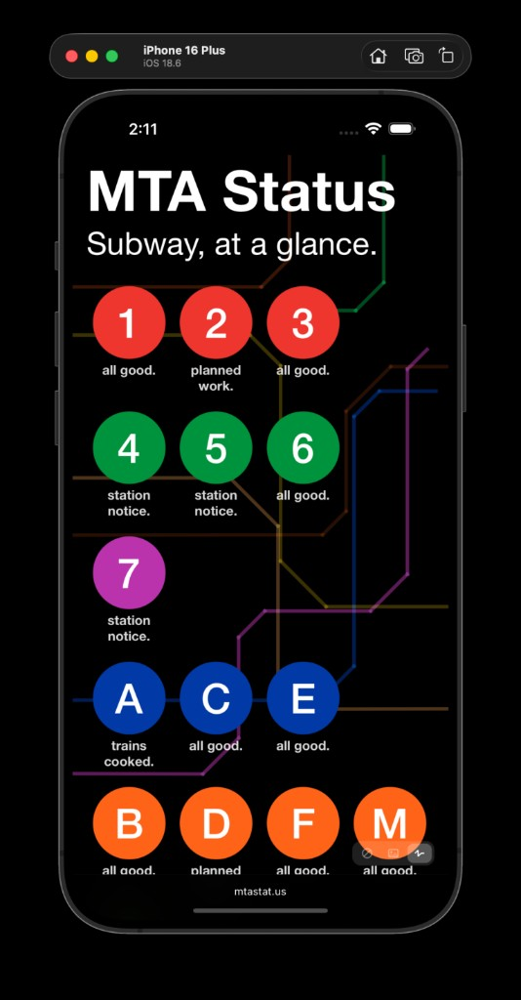
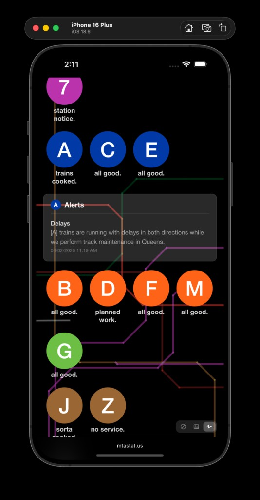

# MTA Status

NYC subway status, at a glance. Live at [mtastat.us](https://mtastat.us).

A SvelteKit rewrite of [mta_status](https://github.com/johnrbell/mta_status) (Ruby/Sinatra).

<p align="center">
  
  &nbsp;&nbsp;
  
</p>

## Features

- Real-time status for all 23 NYC subway lines via the [MTA GTFS-RT alerts feed](https://api-endpoint.mta.info/Dataservice/mtagtfsfeeds/camsys%2Fsubway-alerts.json)
- Severity-ranked alerts — shows the worst active alert per line
- Tap any line with an alert for details inline
- Three background modes: dark, photo (Unsplash), and animated subway map
- 5-minute in-memory cache for train data and background images
- PWA-ready — installable on iOS and Android
- Deployed on Vercel

## Usage

Visit [mtastat.us](https://mtastat.us) in your phone's browser.

**Add to home screen (iOS):** Tap the share button → "Add to Home Screen." The app saves as a standalone icon and launches full-screen — no browser chrome, no address bar. It looks and feels like a native app.

**Add to home screen (Android):** Tap the menu → "Add to Home Screen" (or "Install app" if prompted). Same deal — full-screen, standalone.

Once installed, open it whenever you want a quick read on the subway. Every line is shown with its current status. Tap any line that has an active alert to expand details inline. The footer has a small toggle to cycle between three background modes: solid black, a random NYC photo, or an animated subway map.

Data refreshes from the MTA feed each time you open the app or tap the title. Results are cached for 5 minutes.

## Setup

```bash
npm install
npm run dev
```

Runs at [localhost:5173](http://localhost:5173).

Production build:

```bash
npm run build
npm start
```

### Environment variables

| Variable | Required | Description |
|---|---|---|
| `UNSPLASH_ACCESS_KEY` | No | Enables random NYC background photos. Without it, a default set is used. |

## Stack

- **SvelteKit** (Svelte 5) with `adapter-vercel`
- **MTA GTFS-RT** JSON feed (no key required)
- **Unsplash API** for background images
